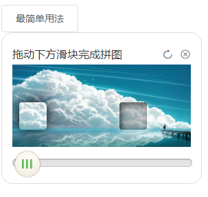
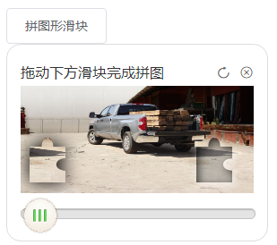
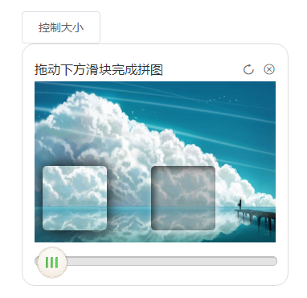

# vue-puzzle-verification
封装的一个用于登录验证的拼图的vue组件，使用了canvas画图和拖拽的一些技巧。canvas的API很好用，可以画出各种图形。
## 效果展示
### 1. 简单用法:
   
```html
<div class="login-box">
  <button @click="handleClick(1)">最简单用法</button>
  <div class="puzzle-box">
    <PuzzleVerification
      v-model="isVerificationShow1"
      :onSuccess="handleSuccess"
    />
  </div>
</div>
```
### 2. 拼图形滑块:
   
 ```html
<div class="login-box">
  <button @click="handleClick(2)">拼图形滑块</button>
  <div class="puzzle-box">
    <PuzzleVerification
      v-model="isVerificationShow2"
      :puzzleImgList="puzzleImgList"
      blockType="puzzle"
      :onSuccess="handleSuccess"
    />
  </div>
</div>
 ```
### 3. 控制大小:
   
```html
<div class="login-box">
  <button @click="handleClick(3)">控制大小</button>
  <div class="puzzle-box">
    <PuzzleVerification
      v-model="isVerificationShow3"
      width="300"
      height="200"
      blockSize="80"
      blockRadius="5"
      :onSuccess="handleSuccess"
    />
  </div>
</div>
```
### 4. 控制误差:
      
```html
<div class="login-box">
  <button @click="handleClick(4)">控制误差</button>
  <div class="puzzle-box">
    <PuzzleVerification
      v-model="isVerificationShow4"
      :puzzleImgList="puzzleImgList"
      deviation="20"
      blockType="puzzle"
      :onSuccess="handleSuccess"
    />
  </div>
</div>
```
### 5. 滑块出现的范围:
     
```html
<div class="login-box">
  <button @click="handleClick(5)">控制滑块出现位置范围</button>
  <div class="puzzle-box">
    <PuzzleVerification
      v-model="isVerificationShow5"
      wraperPadding="50"
      :onSuccess="handleSuccess"
    />
  </div>
</div>
```
## 参数说明

 参数  |  是否必需  |  类型  |  可选值  |  默认值  |  说明
 ---- | ---------- | ------ |  -----  |  ------ | ----
 `v-model` | 是 | --- | --- | --- | 绑定显示与隐藏
 `blockType` | 否 | string | square, puzzle | puzzle | 滑块的形状
 `blockSize` | 否 | string, number | 0 ~ | 40 | 滑块的大小（正方形），不能大于画布尺寸
 `width` | 否 | string, number | 0 ~ | 260 | 画布图片的宽度
 `height` | 否 | string, number | 0 ~ | 120 | 画布图片的高度
 `puzzleImgList` | 否 | array | --- | 三张引用图片 | 传入的图片
 `blockRadius` | 否 | string, number | 0 ~ | 4 | 滑块圆角的大小（仅当其形状是square有效）
 `deviation` | 否 | string, number | 0 ~ | 4 | 滑块吻合的误差
 `wraperPadding` | 否 | string, number | 0 ~ | 20 | 滑块随机出现的范围，数字越大，范围越大（不能大于画布尺寸）
 `onSuccess` | 是 | function | --- | 打印成功信息 | 拼接成功时的回调
 `onError` | 否 | function | --- | 打印失败信息 | 拼接失败时的回调


